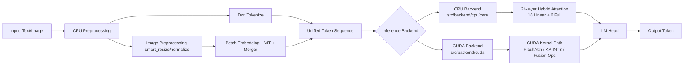

# Qwen3.5-0.8B C++/CUDA Inference Engine

A from-scratch C++ multimodal inference engine with progressive CUDA acceleration and module-level benchmarking.

## Why This Project

- Pure C++17 CPU baseline with optional CUDA optimization path.
- Complete 24-layer hybrid attention backbone (`18 LinearAttention + 6 FullAttention`).
- End-to-end multimodal pipeline (image preprocessing -> vision encoder -> text generation).
- Micro-benchmark + end-to-end benchmark workflow for optimization decisions.
- Layer-by-layer accuracy verification against PyTorch reference implementation.

## Quick Tour (30 seconds)

1. `src/backend/cpu/core/`: Language backbone and decoding path.
2. `src/backend/cpu/vision/`: Image preprocessing, patch embedding, ViT, and merger.
3. `src/backend/cuda/`: GPU kernels and CUDA benchmark executables.
4. `tests/integration/`: End-to-end testing and validation workflows.
5. `docs/README.md`: Documentation index (start with Architecture and Performance Reports).

## Project Structure

```
repo-root/
├── CMakeLists.txt               # Unified build entry
├── src/
│   ├── backend/
│   │   ├── cpu/
│   │   │   ├── core/            # Text model modules (embedding/attn/mlp/lm_head)
│   │   │   └── vision/          # Vision preprocessing + patch/vit/merger
│   │   └── cuda/                # CUDA kernels and GPU benchmark binaries
│   └── cuda/                    # CUDA headers for GPU path
├── tests/
│   ├── unit/                    # Unit tests
│   ├── integration/             # End-to-end tests and validation
│   └── validation/              # Step-by-step correctness checks
├── scripts/
│   ├── weights/                 # Weight export and conversion tools
│   ├── validation/              # Validation helper scripts
│   └── preprocess/              # Image preprocessing reference scripts
├── docs/                        # Architecture/performance/debug reports
├── data/                        # Public sample inputs
└── weights/                     # Local model weights (not committed)
```

## Architecture Diagram



## Quick Start (5 minutes)

### Environment Dependencies

- C++17 compiler (MSVC 2019+, GCC 9+, Clang 10+)
- CMake 3.18+
- Python 3.9+ (optional, for scripts)
- CUDA Toolkit 13.2 (optional, for GPU path)

### 1) Clone and Enter Project

```powershell
git clone <your-repo-url>
cd c++deploy
```

### 2) Prepare Weights (One-time Setup)

```powershell
$env:QWEN_MODEL_PATH = "<path-to>/Qwen3.5-0.8B"
python scripts/weights/export_language_backbone_weights.py
python scripts/weights/export_embedding_weights.py
```

### 3) Build CPU/CUDA

```powershell
# CPU baseline
cmake -B build -DCMAKE_BUILD_TYPE=Release
cmake --build build --config Release

# CUDA optimized path
cmake -B build_cuda -DCMAKE_BUILD_TYPE=Release -DENABLE_CUDA=ON
cmake --build build_cuda --config Release
```

### 4) Run Smoke Tests and Benchmarks

```powershell
# CPU end-to-end
.\build\Release\e2e_inference.exe

# GPU Stage2 benchmark (recommended)
.\build_cuda\Release\stage2_gpu_benchmark.exe D:/deploy/c++deploy/weights 5

# BF16专项 benchmark
.\build_cuda\Release\bf16_gemm_benchmark.exe D:/deploy/c++deploy/weights
```

### 5) FAQ

- `Cannot find weights`: Use absolute path for `weights` directory, avoid working directory inconsistencies.
- `ncu takes too long`: Start with `--set basic` + `--launch-count 1`, then gradually add metrics.
- `No kernels were profiled`: Check if `--kernel-name` matches, try without filtering if needed.

### 6) Command Line Help (--help)

The following executables support `--help` / `-h` for usage information:

- `stage2_cpu_benchmark.exe`
- `stage2_gpu_benchmark.exe`
- `phase3_opt_benchmark.exe`
- `bf16_gemm_benchmark.exe`
- `kv_int8_benchmark.exe`
- `paged_kv_benchmark.exe`
- `batch_poc_benchmark.exe`
- `batch_opt_benchmark.exe`
- `flash_attention_int8_benchmark.exe`
- `vision_patch_embed_benchmark.exe`

Example:

```powershell
.\build\Release\stage2_gpu_benchmark.exe --help
.\build\Release\kv_int8_benchmark.exe --help
```

## Code Style (clang-format)

- Unified style file: `.clang-format`
- Format all code:

```powershell
powershell -ExecutionPolicy Bypass -File .\scripts\format_code.ps1
```

- Check only (no changes):

```powershell
powershell -ExecutionPolicy Bypass -File .\scripts\format_code.ps1 -CheckOnly
```

## Model Configuration

- Hidden size: `1024`
- Intermediate size: `3584`
- Vocabulary size: `248320`
- Attention schedule: `6 × (3 linear + 1 full) = 24 layers`
- Vision encoder: 12-layer ViT (`hidden=768`)

## Weight Preparation

```powershell
$env:QWEN_MODEL_PATH = "<path-to>/Qwen3.5-0.8B"
python scripts/weights/export_language_backbone_weights.py
python scripts/weights/export_embedding_weights.py
```

## Core Performance Comparison

> Data source: `docs/latest_benchmark_summary.md`, `docs/kv_int8_benchmark.md`, `docs/bf16_prefill_benchmark.md`.

| Experiment | Baseline | Optimized | Improvement |
|---|---:|---:|---:|
| KV Cache VRAM | 192 MB (FP32) | 48 MB (INT8) | **4x compression** |
| Decode throughput | 2831.390 tok/s | 4735.230 tok/s | **1.67x** |
| Peak VRAM | 1330 MB | 1188 MB | **-142 MB** |
| Single-layer Prefill latency | 242.294 ms (FP32) | 230.669 ms (BF16) | **1.0504x** |
| Full-model Prefill latency | 639.839 ms (FP32) | 634.372 ms (BF16) | **1.0086x** |

> Note: Full-model BF16 prefill shows marginal improvement. Future optimization focus: dtype conversion and pipeline scheduling.

## Framework Comparison (vs llama.cpp / vLLM / TensorRT-LLM)

> Comparison principle: Same model, same quantization strategy, same hardware, same input length and sampling parameters. No cross-framework conclusions without standardized conditions.

| Framework | Positioning | Strengths | Current Limitations | This Project Status |
|---|---|---|---|---|
| This Project (C++/CUDA) | Controllable operator R&D and optimization verification | Full code control, kernel-level experiments (KV INT8/fusion/BF16) | Ecosystem and deployment need improvement | Core optimization pipeline complete |
| llama.cpp | Lightweight local inference | Simple deployment, CPU-friendly, mature quantization ecosystem | Limited large-scale serving capability | - |
| vLLM | Serving throughput optimization | Continuous batching, Paged Attention, mature online serving | Lower kernel controllability than custom kernels | - |
| TensorRT-LLM | Industrial high-performance inference | TensorRT graph optimization and high throughput | Complex engineering integration, high tuning barrier | - |

### Performance Data (RTX 5060 Ti)

| Metric | Value |
|---|---:|
| Prefill latency (ms, prompt=32) | 639.839 (FP32) / 634.372 (BF16) |
| Decode latency (ms/token) | 0.353 -> 0.211 (KV INT8 optimized) |
| Decode throughput (tok/s) | 2831 -> 4735 (KV INT8 optimized) |
| Peak VRAM (MB) | 1330 -> 1188 (KV INT8 optimized) |
| KV Cache占用 (MB) | 192 -> 48 (INT8 quantization, 4x compression) |

> Note: Comparison with llama.cpp / vLLM / TensorRT-LLM requires standardized testing under identical hardware environment. Cross-framework data is not provided to avoid misleading conclusions.

## Documentation

- Main index: [docs/README.md](docs/README.md)
- Summary: [docs/interview_project_summary.md](docs/interview_project_summary.md)
- Architecture: [docs/qwen3_5_0_8b_architecture.md](docs/qwen3_5_0_8b_architecture.md)
- CUDA Migration: [docs/cuda_migration_analysis.md](docs/cuda_migration_analysis.md)
- Performance Report: [docs/performance_report.md](docs/performance_report.md)
