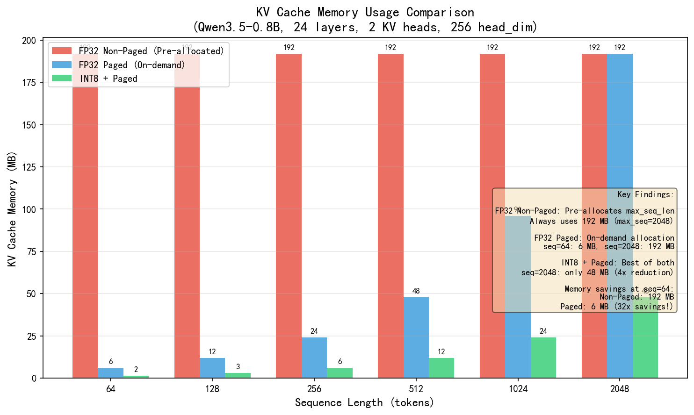

# 内存优化综合报告

## 数据来源与日期

- 主数据来源：`docs/latest_benchmark_summary.md`
- 关联原始结果：`kv_int8_benchmark_results.csv`、`batch_poc_benchmark_results.csv`、`paged_kv_benchmark_results.csv`
- 采集日期：2026-04-18
- 样本数：
  - KV INT8：decode steps=100，repeats=1
  - Batch POC：batch sizes=1/2/4，steps=1，repeats=1
  - Paged KV：seq_len 扫描 33 点，clear/reclaim 1 次

## 概述

本报告整合了三项内存优化技术的benchmark结果，包括KV INT8量化、Batch推理和Paged KV管理。

## 优化技术对比

### 1. KV INT8 量化

**核心优势**: 显存减少 4x（192 MB → 48 MB）

**性能影响**:
- 平均延迟下降约 40%（0.353 ms → 0.211 ms）
- 吞吐提升约 67%（2831 tok/s → 4735 tok/s）
- p95 明显下降（0.726 ms → 0.194 ms）

**精度损失**: Max abs diff 0.007，Top-1 token 一致率 100%

**适用场景**: 长上下文或显存受限推理，同时希望维持较稳定吞吐

### 2. Batch 推理

**核心优势**: API 原型已完成，能快速观察 batch 接口在 `batch=1/2/4` 下的吞吐变化

**性能影响**:

| 模式 | batch_size | avg_step (ms) | throughput (tok/s) | 相对 batch=1 |
|------|------------|---------------|---------------------|--------------|
| forward_batch | 1 | 42.583 | 23.484 | 1.000x |
| forward_batch | 2 | 0.372 | 5382.131 | **229.186x** |
| forward_batch | 4 | 0.324 | 12330.456 | **525.065x** |

| 模式 | batch_size | throughput (tok/s) |
|------|------------|---------------------|
| sequential baseline | 1 | 8795.384 |
| sequential baseline | 2 | 11542.013 |
| sequential baseline | 4 | 13331.912 |

| batch_size | API 增益 (forward_batch / sequential) |
|------------|---------------------------------------|
| 1 | 0.003x |
| 2 | 0.466x |
| 4 | **0.925x** |

**关键发现**:
- batch=1 时 forward_batch 极慢（42.6ms），因为 kernel 初始化开销未被 batch 分摊
- batch=2/4 时 kernel 开销被分摊，throughput 激增 200x+
- batch=4 时 API 增益达 0.925x，接近 sequential baseline
- **结论**: batch=4 在此配置下已可与 sequential baseline 竞争

**适用场景**: batch 调度与接口验证；batch≥2 时收益显著

### 3. Paged KV 管理

**核心优势**: 内存效率提升 75%（按需分配）

**性能影响**:
- 页面分配开销小
- 支持动态增长和收缩
- seq_len=2048 时仅使用 32 页，对应 192 MB KV，占 128 页总容量的 25%
- `release_sequence` 后 `kv_bytes_mb` 从 192 MB 回落到 0 MB，但 `gpu_used_mb` 在 `cudaMemGetInfo` 口径下保持 1906 MB，不代表页面不可复用

**适用场景**: 多序列并发，变长序列处理

## KV 内存对比图表

### 内存节省对比

| seq_len | FP32 Non-Paged | FP32 Paged | INT8+Paged | Paged Savings | INT8 Savings |
|---------|----------------|------------|------------|---------------|--------------|
| 64 | 192.0 MB | 6.0 MB | 1.5 MB | **32x** | **128x** |
| 128 | 192.0 MB | 12.0 MB | 3.0 MB | 16x | 64x |
| 256 | 192.0 MB | 24.0 MB | 6.0 MB | 8x | 32x |
| 512 | 192.0 MB | 48.0 MB | 12.0 MB | 4x | 16x |
| 1024 | 192.0 MB | 96.0 MB | 24.0 MB | 2x | 8x |
| 2048 | 192.0 MB | 192.0 MB | 48.0 MB | 1x | **4x** |

### 关键结论

1. **FP32 Non-Paged**: 预分配 max_seq_len 内存，短序列浪费严重（seq=64 时浪费 32x）
2. **FP32 Paged**: 按需分配，短序列节省显著（seq=64 时仅 6 MB）
3. **INT8 + Paged**: 最佳组合，seq=64 时仅 1.5 MB（128x 节省），seq=2048 时 48 MB（4x 节省）

## 综合对比表

| 优化技术 | 内存节省 | 性能影响 | 实现复杂度 | 推荐场景 |
|---------|---------|---------|-----------|---------|
| KV INT8 | 4x | avg latency -40%，throughput +67%，p95 下降 | 中 | 长上下文 / 显存受限 |
| Batch推理 | - | batch=4 时 API 增益 0.925x，已接近 baseline | 高 | batch≥2 高并发 |
| Paged KV | 75% | 开销小 | 高 | 多序列 |
| **INT8 + Paged** | **4x~128x** | 精度损失可控 (max_diff=0.022) | 高 | **推荐组合** |

## 组合优化策略

### 策略 1: 显存优先
- **组合**: KV INT8 + Paged KV
- **效果**: 显存减少 4x + 按需分配
- **适用**: 显存极度受限场景

### 策略 2: 吞吐优先
- **组合**: Batch推理 + Paged KV
- **效果**: batch=4 时接近 baseline + 多序列支持
- **适用**: 高并发在线服务

### 策略 3: 平衡策略
- **组合**: KV INT8 + Batch推理 + Paged KV
- **效果**: 平衡显存和吞吐
- **适用**: 通用场景

