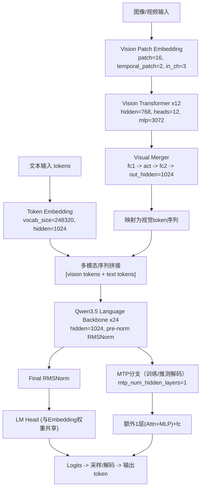
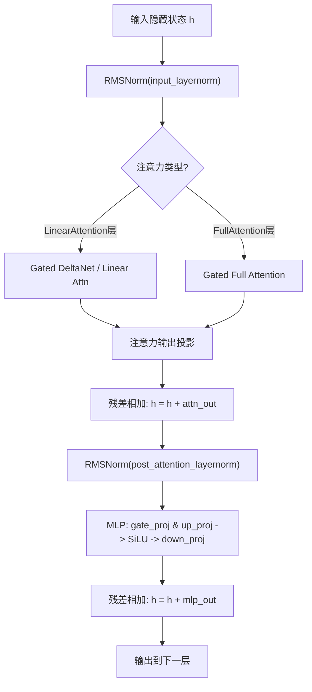
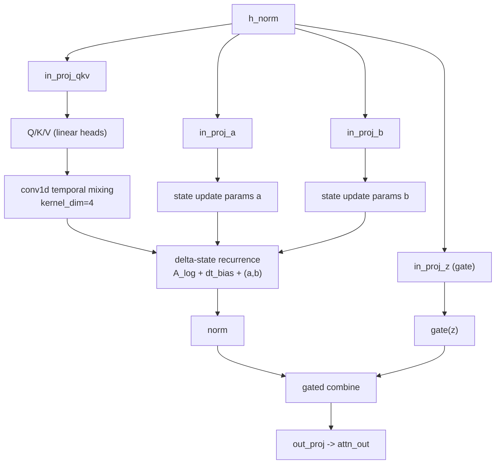
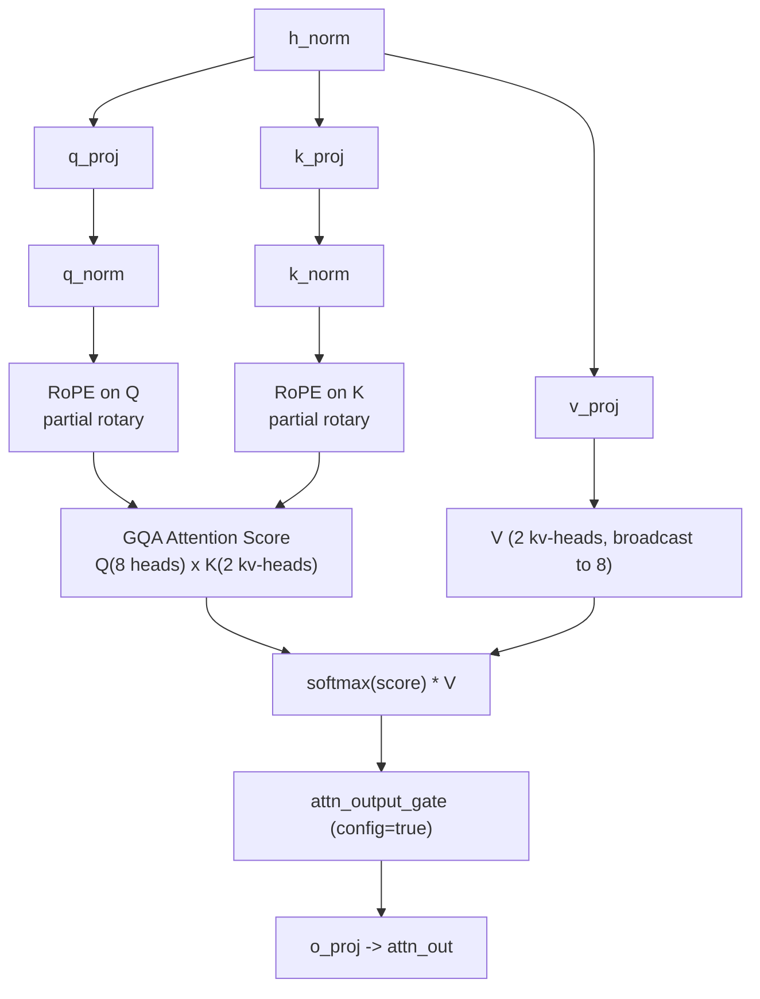
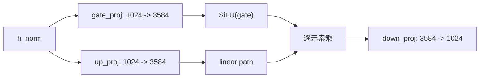
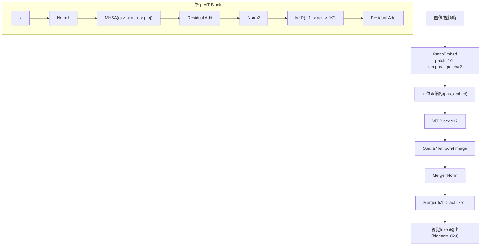

# Qwen3.5-0.8B 详细架构图

本文档基于本地模型目录 `D:\deploy\modules\modles\Qwen3.5-0.8B` 的 `config.json` 与权重索引自动整理，给出可视化的“逐过程连接”架构图。

## 1) 总体架构（多模态到生成）

---

## 2) 语言主干层级调度图（24层）

配置中 `full_attention_interval=4`，并给出显式 `layer_types`：
- 0,1,2 线性注意力；3 全注意力
- 4,5,6 线性注意力；7 全注意力
- ...
- 20,21,22 线性注意力；23 全注意力

等价为：`6 × (3 × LinearAttention + 1 × FullAttention)`。

```mermaid
flowchart LR
    L0["L0 Linear"] --> L1["L1 Linear"] --> L2["L2 Linear"] --> L3["L3 Full"]
    L3 --> L4["L4 Linear"] --> L5["L5 Linear"] --> L6["L6 Linear"] --> L7["L7 Full"]
    L7 --> L8["L8 Linear"] --> L9["L9 Linear"] --> L10["L10 Linear"] --> L11["L11 Full"]
    L11 --> L12["L12 Linear"] --> L13["L13 Linear"] --> L14["L14 Linear"] --> L15["L15 Full"]
    L15 --> L16["L16 Linear"] --> L17["L17 Linear"] --> L18["L18 Linear"] --> L19["L19 Full"]
    L19 --> L20["L20 Linear"] --> L21["L21 Linear"] --> L22["L22 Linear"] --> L23["L23 Full"]
```

---

## 3) 单个语言层内部连接（通用骨架）

每层均为 pre-norm + residual 结构：

---

## 4) LinearAttention（Gated DeltaNet）细节连接

根据权重命名可见该分支包含：
- `in_proj_qkv`
- `in_proj_a`, `in_proj_b`, `in_proj_z`（门控/状态相关投影）
- `conv1d`（kernel_dim=4）
- `A_log`, `dt_bias`（状态更新参数）
- `norm`, `out_proj`

头部参数：
- `linear_num_key_heads=16`
- `linear_num_value_heads=16`
- `linear_key_head_dim=128`
- `linear_value_head_dim=128`

---

## 5) FullAttention（Gated Attention）细节连接

配置参数：
- `num_attention_heads=8`
- `num_key_value_heads=2`（GQA）
- `head_dim=256`
- RoPE: `partial_rotary_factor=0.25`, `rope_theta=1e7`, `mrope_interleaved=true`

---

## 6) MLP 细节连接（每层）

---

## 7) 视觉编码器内部连接

配置参数：
- `depth=12`
- `hidden_size=768`
- `num_heads=12`
- `intermediate_size=3072`
- `spatial_merge_size=2`
- 输出维度经 merger 到 `1024`

---

## 8) 关键超参总表（来自本地配置）

- 语言主干：`num_hidden_layers=24`, `hidden_size=1024`
- 布局：`6 × (3×LinearAttention + 1×FullAttention)`
- 线性注意力头：`16(K)` / `16(V)`, head dim `128`
- 全注意力头：`8(Q)` / `2(KV)`, head dim `256`
- MLP中间层：`3584`
- 激活：`SiLU`
- 归一化：`RMSNorm`, `eps=1e-6`
- 最大上下文：`262144`
- 词表：`248320`, 且 `tie_word_embeddings=true`
- 视觉编码器：`depth=12`, `hidden=768`, `heads=12`, `mlp=3072`
- MTP：`mtp_num_hidden_layers=1`

---

## 9) 说明

1. 上图基于你本地权重结构与配置文件，不是通用“猜测图”。
2. 对 LinearAttention 的内部数学细节，官方代码中可能还有实现级优化（如张量重排、缓存策略）；本图按权重命名与结构配置还原主要连接过程。

---

## 10) 实现级细分文档

已生成更细的模块拆解文档（用于直接写代码和加载参数）：

- `qwen3_5_0_8b_details/00_总览与索引.md`
- `qwen3_5_0_8b_details/01_总体架构_实现级流程.md`
- `qwen3_5_0_8b_details/02_文本主干_24层调度与参数映射.md`
- `qwen3_5_0_8b_details/03_LinearAttention_GatedDeltaNet_细节.md`
- `qwen3_5_0_8b_details/04_FullAttention_GQA_RoPE_细节.md`
- `qwen3_5_0_8b_details/05_MLP_层归一化_输出头.md`
- `qwen3_5_0_8b_details/06_视觉编码器与Merger_细节.md`
- `qwen3_5_0_8b_details/07_MTP分支与推测解码_参数加载.md`

