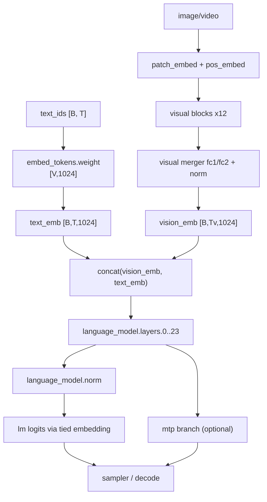

# 总体架构（实现级流程）

## 1. 输入与路由

1. 文本 token ids -> 文本嵌入 `E_text`
2. 图像/视频输入 -> 视觉编码器 -> 视觉 token 特征 `E_vision`
3. 将视觉 token 与文本 token 按模板拼接，进入统一语言主干
4. 经过 24 层混合注意力主干后，得到隐藏状态 `H`
5. `H` 经最终 RMSNorm + tied embedding projection -> logits
6. 解码输出（可选 MTP 推测分支辅助）

## 2. 端到端模块图（细粒度）



> 可视化增强版（ONNX/Neural 风格 HTML）：  
> `01_总体架构_实现级流程_神经图风格.html`  
> 包含：端到端主图、Linear/Full 单层细节图、24层逐层状态变化表。

## 3. 主干层类型调度（必须严格一致）

`config.json/text_config/layer_types` 明确给出 24 层：

- `0,1,2`：`linear_attention`
- `3`：`full_attention`
- `4,5,6`：`linear_attention`
- `7`：`full_attention`
- `8,9,10`：`linear_attention`
- `11`：`full_attention`
- `12,13,14`：`linear_attention`
- `15`：`full_attention`
- `16,17,18`：`linear_attention`
- `19`：`full_attention`
- `20,21,22`：`linear_attention`
- `23`：`full_attention`

即：`6 × (3×Linear + 1×Full)`。

## 4. 推理主循环伪代码

```python
def forward(inputs):
    text_emb = embed_text(inputs.text_ids)                 # [B,T,1024]
    vision_emb = encode_vision(inputs.media) if has_media else None
    x = fuse_tokens(vision_emb, text_emb, inputs.template) # [B,Tall,1024]

    for i in range(24):
        x = block_forward(i, x, cache=kv_or_state_cache)

    x = rms_norm_final(x, w=lm_norm_w)
    logits = project_tied(x, embed_w)  # tie_word_embeddings=True
    return logits
```

## 5. 参数加载顺序建议（避免遗漏）

1. 先加载嵌入和最终 norm
2. 逐层加载 `input_layernorm -> attn -> post_layernorm -> mlp`
3. 按 `layer_types[i]` 决定加载 `linear_attn.*` 或 `self_attn.*`
4. 最后加载视觉模块与 MTP 模块
5. 对每层做 key 完整性校验（存在性 + shape）

