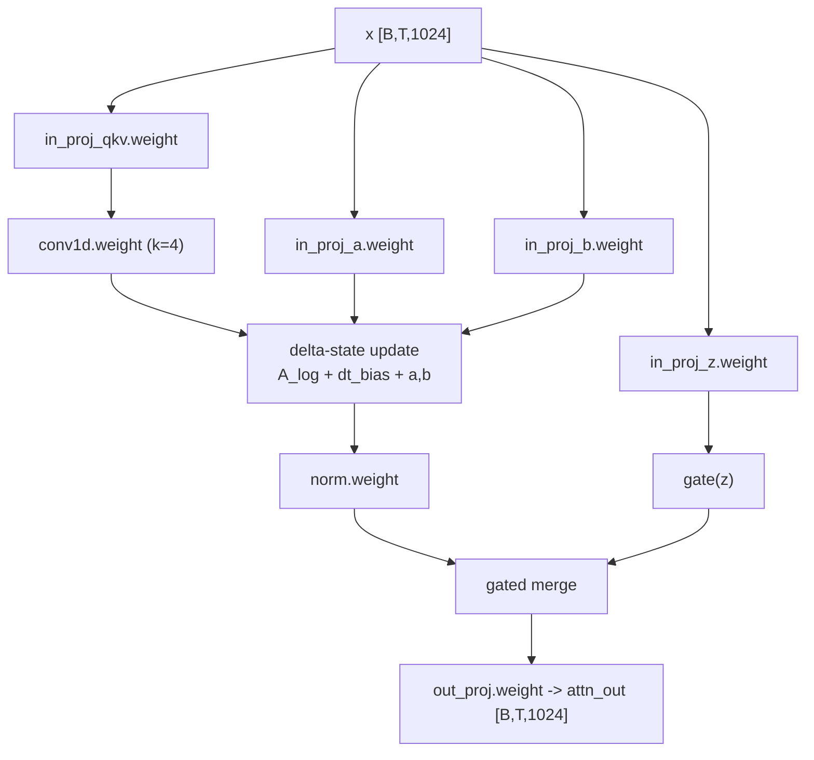

# LinearAttention（Gated DeltaNet）细节

适用层：`0,1,2,4,5,6,8,9,10,12,13,14,16,17,18,20,21,22`

## 1. 配置要点

- `linear_num_key_heads = 16`
- `linear_num_value_heads = 16`
- `linear_key_head_dim = 128`
- `linear_value_head_dim = 128`
- `linear_conv_kernel_dim = 4`
- `mamba_ssm_dtype = float32`（状态更新相关建议 fp32）

## 2. 计算流程（实现顺序）

1. 输入 `x`（已过 input RMSNorm）
2. `in_proj_qkv(x)` -> 线性头所需的 Q/K/V 相关张量
3. `in_proj_a(x), in_proj_b(x)` -> 状态更新辅助参数
4. `conv1d(...)` 做局部时序混合
5. 使用 `A_log` 与 `dt_bias` 执行 delta-state 递推
6. `norm` 归一化状态输出
7. `in_proj_z(x)` 生成门控分量
8. 门控融合后 `out_proj` 回到 `hidden_size=1024`

## 3. 参数键（第 i 层）

- `model.language_model.layers.{i}.linear_attn.in_proj_qkv.weight`
- `model.language_model.layers.{i}.linear_attn.in_proj_a.weight`
- `model.language_model.layers.{i}.linear_attn.in_proj_b.weight`
- `model.language_model.layers.{i}.linear_attn.in_proj_z.weight`
- `model.language_model.layers.{i}.linear_attn.conv1d.weight`
- `model.language_model.layers.{i}.linear_attn.A_log`
- `model.language_model.layers.{i}.linear_attn.dt_bias`
- `model.language_model.layers.{i}.linear_attn.norm.weight`
- `model.language_model.layers.{i}.linear_attn.out_proj.weight`

## 4. 图示（参数到算子映射）

## 5. 落地建议（代码）

- 为 LinearAttention 单独定义 `state_cache`（区别于 full attn 的 KV cache）
- 递推相关算子建议在 fp32 计算后再 cast 回推理 dtype
- 明确区分：
  - `conv1d` 是局部混合
  - `A_log/dt_bias` 是状态动力学参数
- 先实现“全序列版本”再做增量解码版本，便于对齐数值

