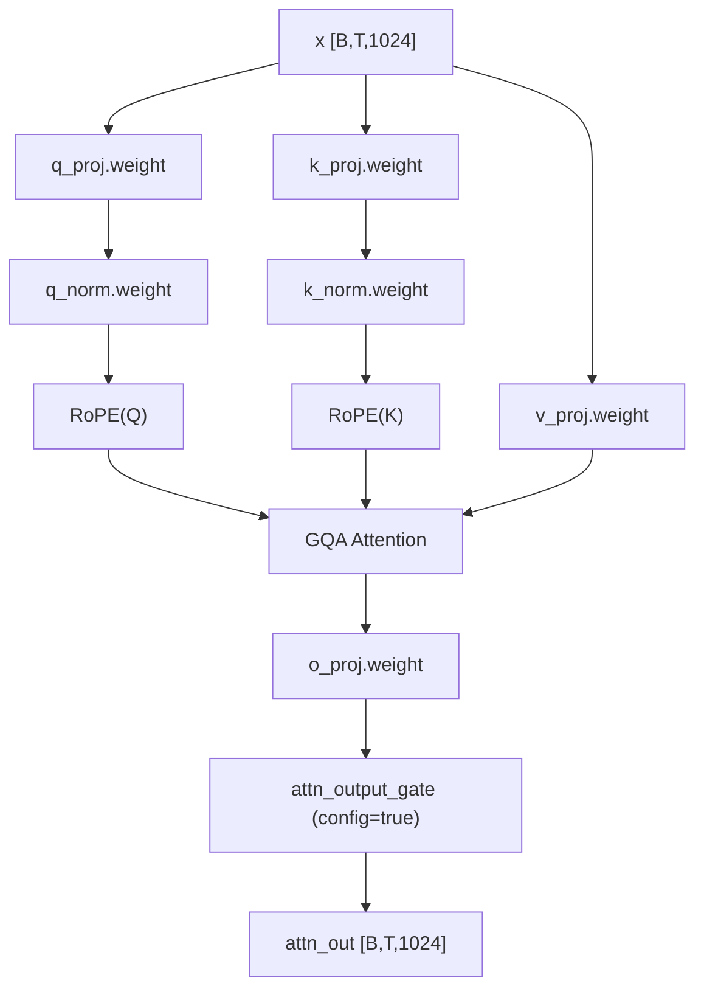

# FullAttention（GQA + RoPE + 输出门控）细节

适用层：`3,7,11,15,19,23`

## 1. 配置要点

- `num_attention_heads = 8`（Q 头数）
- `num_key_value_heads = 2`（KV 头数，GQA）
- `head_dim = 256`
- `attn_output_gate = true`
- RoPE:
  - `rope_theta = 10000000`
  - `partial_rotary_factor = 0.25`
  - `mrope_interleaved = true`

## 2. 计算流程（实现顺序）

1. 输入 `x`（已过 input RMSNorm）
2. 线性投影：`q_proj, k_proj, v_proj`
3. `q_norm, k_norm`
4. 对 Q/K 应用（部分维度）RoPE
5. GQA 注意力：Q(8 heads) 对 K/V(2 kv-heads) 进行组查询
6. 注意力输出经 `o_proj` 回到 1024 维
7. 由于 `attn_output_gate=true`，对输出应用门控融合（实现可能在模块内部）

## 3. 参数键（第 i 层）

- `model.language_model.layers.{i}.self_attn.q_proj.weight`
- `model.language_model.layers.{i}.self_attn.k_proj.weight`
- `model.language_model.layers.{i}.self_attn.v_proj.weight`
- `model.language_model.layers.{i}.self_attn.q_norm.weight`
- `model.language_model.layers.{i}.self_attn.k_norm.weight`
- `model.language_model.layers.{i}.self_attn.o_proj.weight`

## 4. 图示（参数到算子映射）

## 5. 落地建议（代码）

- GQA 实现时注意 Q 头和 KV 头广播规则
- RoPE 只作用于 `partial_rotary_factor` 对应子维度
- 增量解码时该层使用标准 KV cache
- 建议先做不带 cache 的全序列对齐测试，再开启 cache

