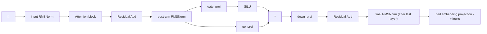

# MLP / 层归一化 / 输出头

## 1. RMSNorm（每层两处）

第 `i` 层：
- `input_layernorm.weight`
- `post_attention_layernorm.weight`

末尾：
- `model.language_model.norm.weight`

公式（无偏置）：

`RMSNorm(x, w) = w * x / sqrt(mean(x^2) + eps)`，`eps=1e-6`

## 2. MLP 结构（SwiGLU风格）

配置：
- `hidden_size = 1024`
- `intermediate_size = 3584`
- `hidden_act = silu`

流程：
1. `g = gate_proj(x)`  -> `[B,T,3584]`
2. `u = up_proj(x)`    -> `[B,T,3584]`
3. `m = silu(g) * u`
4. `y = down_proj(m)`  -> `[B,T,1024]`

参数键（第 i 层）：
- `model.language_model.layers.{i}.mlp.gate_proj.weight`
- `model.language_model.layers.{i}.mlp.up_proj.weight`
- `model.language_model.layers.{i}.mlp.down_proj.weight`

## 3. 输出头（tied embedding）

- 嵌入矩阵：`model.language_model.embed_tokens.weight`，shape `[248320,1024]`
- `tie_word_embeddings=true`：输出 logits 使用同一矩阵（转置投影）

常见实现：

```python
logits = x @ embed_tokens_weight.T
```

## 4. 图示



