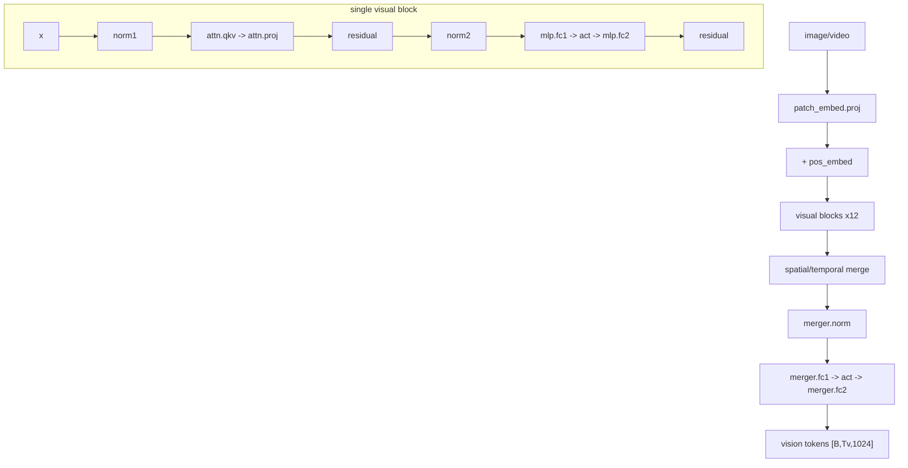

# 视觉编码器与 Merger 细节

## 1. 配置要点（vision_config）

- `depth = 12`
- `hidden_size = 768`
- `num_heads = 12`
- `intermediate_size = 3072`
- `patch_size = 16`
- `temporal_patch_size = 2`
- `num_position_embeddings = 2304`
- `out_hidden_size = 1024`
- `spatial_merge_size = 2`

## 2. 视觉前向流程

1. `patch_embed.proj`：将图像/视频切片映射到 `768`
2. 加上 `pos_embed`
3. 进入 12 层视觉 Transformer blocks
4. 每个 block：`norm1 -> attn(qkv/proj) -> residual -> norm2 -> mlp(fc1/fc2) -> residual`
5. 通过 merger（norm + fc1 + fc2）投影到 `1024`
6. 输出视觉 token，供语言主干拼接

## 3. 参数键映射

### 3.1 patch/position

- `model.visual.patch_embed.proj.weight`
- `model.visual.patch_embed.proj.bias`
- `model.visual.pos_embed.weight`

### 3.2 视觉 block（第 j 层，j=0..11）

- 注意力：
  - `model.visual.blocks.{j}.attn.qkv.weight`
  - `model.visual.blocks.{j}.attn.qkv.bias`
  - `model.visual.blocks.{j}.attn.proj.weight`
  - `model.visual.blocks.{j}.attn.proj.bias`
- MLP：
  - `model.visual.blocks.{j}.mlp.linear_fc1.weight`
  - `model.visual.blocks.{j}.mlp.linear_fc1.bias`
  - `model.visual.blocks.{j}.mlp.linear_fc2.weight`
  - `model.visual.blocks.{j}.mlp.linear_fc2.bias`
- 归一化：
  - `model.visual.blocks.{j}.norm1.weight`
  - `model.visual.blocks.{j}.norm1.bias`
  - `model.visual.blocks.{j}.norm2.weight`
  - `model.visual.blocks.{j}.norm2.bias`

### 3.3 merger

- `model.visual.merger.norm.weight`
- `model.visual.merger.norm.bias`
- `model.visual.merger.linear_fc1.weight`
- `model.visual.merger.linear_fc1.bias`
- `model.visual.merger.linear_fc2.weight`
- `model.visual.merger.linear_fc2.bias`

## 4. 图示

## 5. 落地建议（代码）

- 视觉分支与文本分支维度不同（768 vs 1024），必须经 merger 转换后再拼接
- 如果你只做文本模式，可提供 `language_model_only` 开关跳过视觉编码
- 视频模式需按 `temporal_patch_size` 和预处理策略产出时序 patch

