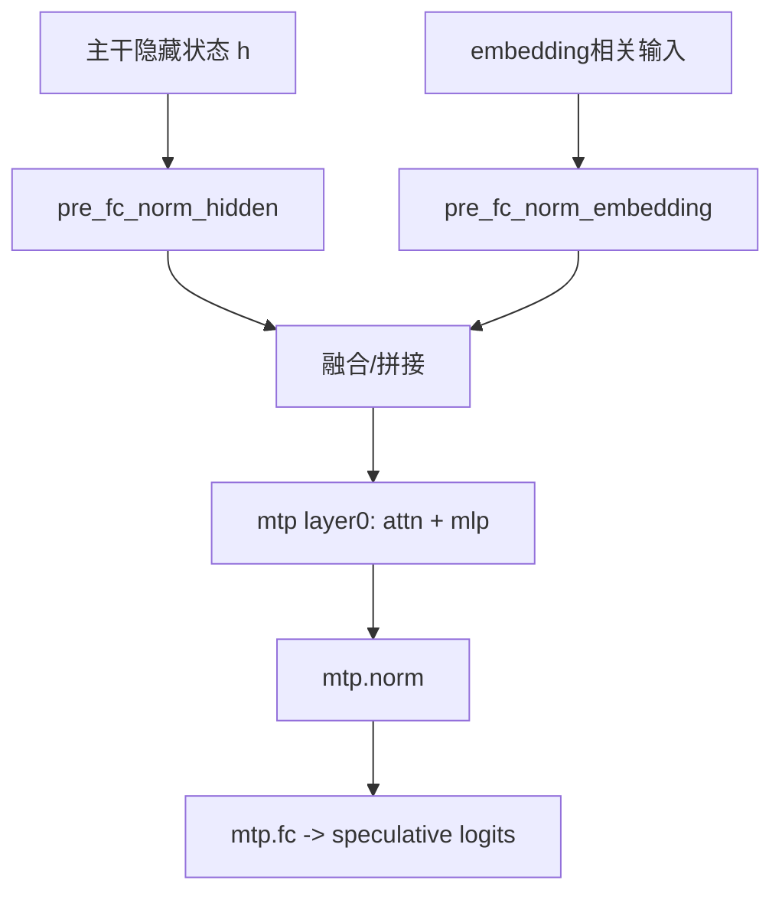

# MTP 分支与参数加载（可直接写代码）

## 1. MTP 配置

- `mtp_num_hidden_layers = 1`
- `mtp_use_dedicated_embeddings = false`

说明：MTP 是附加分支，用于多 token 预测/推测解码场景；主生成路径仍可独立工作。

## 2. MTP 参数键

- `mtp.layers.0.input_layernorm.weight`
- `mtp.layers.0.self_attn.q_proj.weight`
- `mtp.layers.0.self_attn.k_proj.weight`
- `mtp.layers.0.self_attn.v_proj.weight`
- `mtp.layers.0.self_attn.q_norm.weight`
- `mtp.layers.0.self_attn.k_norm.weight`
- `mtp.layers.0.self_attn.o_proj.weight`
- `mtp.layers.0.post_attention_layernorm.weight`
- `mtp.layers.0.mlp.gate_proj.weight`
- `mtp.layers.0.mlp.up_proj.weight`
- `mtp.layers.0.mlp.down_proj.weight`
- `mtp.norm.weight`
- `mtp.pre_fc_norm_embedding.weight`
- `mtp.pre_fc_norm_hidden.weight`
- `mtp.fc.weight`

## 3. MTP 连接流程



## 4. 参数加载器模板（推荐）

```python
def load_required_keys(state_dict, keys):
    missing = [k for k in keys if k not in state_dict]
    if missing:
        raise KeyError(f"missing keys: {missing[:8]} ... total={len(missing)}")

def text_layer_keys(i, is_linear):
    base = [
        f"model.language_model.layers.{i}.input_layernorm.weight",
        f"model.language_model.layers.{i}.post_attention_layernorm.weight",
        f"model.language_model.layers.{i}.mlp.gate_proj.weight",
        f"model.language_model.layers.{i}.mlp.up_proj.weight",
        f"model.language_model.layers.{i}.mlp.down_proj.weight",
    ]
    if is_linear:
        base += [
            f"model.language_model.layers.{i}.linear_attn.in_proj_qkv.weight",
            f"model.language_model.layers.{i}.linear_attn.in_proj_a.weight",
            f"model.language_model.layers.{i}.linear_attn.in_proj_b.weight",
            f"model.language_model.layers.{i}.linear_attn.in_proj_z.weight",
            f"model.language_model.layers.{i}.linear_attn.conv1d.weight",
            f"model.language_model.layers.{i}.linear_attn.A_log",
            f"model.language_model.layers.{i}.linear_attn.dt_bias",
            f"model.language_model.layers.{i}.linear_attn.norm.weight",
            f"model.language_model.layers.{i}.linear_attn.out_proj.weight",
        ]
    else:
        base += [
            f"model.language_model.layers.{i}.self_attn.q_proj.weight",
            f"model.language_model.layers.{i}.self_attn.k_proj.weight",
            f"model.language_model.layers.{i}.self_attn.v_proj.weight",
            f"model.language_model.layers.{i}.self_attn.q_norm.weight",
            f"model.language_model.layers.{i}.self_attn.k_norm.weight",
            f"model.language_model.layers.{i}.self_attn.o_proj.weight",
        ]
    return base
```

## 5. 推荐的加载校验

1. `dtype` 校验（权重 dtype 与计算 dtype）
2. `shape` 校验（尤其是 q/k/v 与 mlp 三投影）
3. 层类型一致性校验（`layer_types[i]` 与加载分支）
4. 视觉分支是否可选加载（文本模式可跳过）
5. MTP 是否可选加载（无推测解码可跳过）

